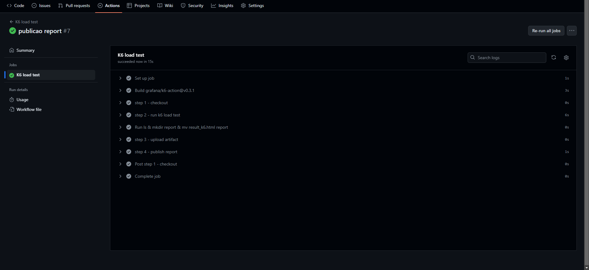

## 🚀 Introdução:
Projeto de Teste de Performance utilizando K6 com a linguagem JavaScript através da plataforma demoblaze visando validar ao adicionar produto ao carrinho de compra.

## 📚 Conceitos gerais:
O teste de desempenho é uma avaliação sistemática do comportamento do sistema sob diferentes condições de carga, visando medir e melhorar sua velocidade, escalabilidade, estabilidade e confiabilidade. Ele busca identificar potenciais gargalos, otimizar recursos e garantir que o sistema atenda aos requisitos de desempenho esperados pelo usuário.
Breakpoint Test (Teste de Ponto de Ruptura): Avalia o sistema para determinar o ponto exato em que ele falha ou atinge seu limite máximo de capacidade.

- **Load Test (Teste de Carga):** Avalia o comportamento do sistema sob condições normais de carga para verificar desempenho, estabilidade e escalabilidade.

- **Smoke Test (Teste de Fumaça):** Teste rápido e superficial para verificar se as - principais funcionalidades do sistema estão funcionando corretamente, geralmente realizado após mudanças significativas no código ou na infraestrutura.

- **Soak Test (Teste de Durabilidade):** Avalia o comportamento do sistema ao longo de um período prolongado de tempo sob carga constante, buscando identificar problemas de vazamento de recursos ou degradação do desempenho.

- **Spike Test (Teste de Pico):** Avalia como o sistema se comporta quando há picos repentinos e significativos de tráfego, simulando eventos como lançamento de produto, campanhas promocionais ou eventos de notícias.

- **Stress Test (Teste de Estresse):** Testa os limites do sistema, aumentando gradualmente a carga até que o sistema comece a mostrar sinais de estresse, como tempo de resposta lento ou erros.

## 💻 Tecnologias e ferramentas
- K6
- JavaScript
- Grafana Cloud
- Jenkins
- Github Actions

## 🤖 Comandos para executar o projeto
- Executar na máquina local

```
k6 run {nome do arquivo}.js
```

- Executar e gerar relatório em HTML, precisa adicionar as seguintes configurações:
    - Há exemplo no arquivo 'smoke-test.js'

```
// Fazer o importe do report HTML
import { htmlReport } from "https://raw.githubusercontent.com/benc-uk/k6-reporter/main/dist/bundle.js";

// adicionar o comando abaixo na desmontagem da execução do teste
export function handleSummary(data) {
  return {
    "result_k6.html": htmlReport(data),
  };
}

// executar o comando:
k6 run {nome do arquivo}.js
```

- Executar e gerar relatório no K6 Dashboard através do Git Bash
    - Acessar o endereço do K6 dashboard: http://localhost:5665/ 

```
K6_WEB_DASHBOARD=true k6 run {nome do arquivo}.js
K6_WEB_DASHBOARD=true K6_WEB_DASHBOARD_EXPORT={nome relatorio}.html k6 run {nome do arquivo}.js
```

## Configuração e execução no Github Action
Incluir na raiz do projeto as pastas: .github > workflows > {arquivo_configuracao}.yml
```
name: K6 load test
on: [push]
permissions:
  contents: write
jobs:
  build: 
    name: K6 load test
    runs-on: ubuntu-latest
    steps:
      - name: step 1 - checkout
        uses: actions/checkout@v4

      - name: step 2 - run k6 load test
        uses: grafana/k6-action@v0.3.1
        with: 
          filename: tests/smoke-test.js

      - run: ls & mkdir report & mv result_k6.html report
      
      - name: step 3 - upload artifact
        uses: actions/upload-artifact@v4
        with: 
          name: relatorio de testes de performance
          path: report
          
      - name: step 4 - publish report
        uses: peaceiris/actions-gh-pages@v3
        with:
          github_token: ${{ secrets.GITHUB_TOKEN }}
          publish_branch: gh-pages
          publish_dir: report
```

## Configuração e execução no Grafana Cloud
Após logar no Grafana Cloud, é necessário obter o token em: Home> Testing & synthetics > Performance > Settings > Personal API token.
- Após obtido o token, executar na pasta do projeto através do gitbash/powershell
```
k6 login cloud --token {token obtido em Personal API token}
```
- Adicionar o comando abaixo ao script em options:
  - O ID do projeto está localizado em: Home> Testing & synthetics > Performance > Projects > Pasta do projeto cadastrado
  - Há exemplo no arquivo 'load-test.js'
```
export const options = {
ext: {
        loadimpact: {
            projectID: {ID do projeto}
        }
    }
}    
```    

- Comando para executar integrado ao Grafana Cloud

```
k6 cloud {nome do arquivo}.js
k6 run --out cloud {nome do arquivo}.js
```

## Configuração e execução em Pipeline (Jenkins), integrando ao Grafana Cloud:
Após logar no Jenkins, acesse: Nova Tarefa > Digita nome da Pipeline > Selecione Pipeline > Preencha os dados abaixo no Script da Pipeline:
  - No campo Build Triggers > Construir periodicamente > Preencha com a data para ser executado periodicamente > Após salvar clicar em Construir agora

```
pipeline {
    agent any

    environment{
        K6_CLOUD_TOKEN = credentials("nome_variavel")
        K6_CLOUD_PROJECT_ID = 'id_grafana_cloud'
    }

    stages {
        
        stage('Get Source Code') {
            steps {
                git branch: 'main', url: 'link_repositorio'
            }
        }
        
        stage('Run test') {
            steps {
                bat 'k6 cloud {nome do arquivo}.js --quiet'
            }
        }
    }
}
```

## 📉 Explicação das métricas do K6:
- **Checks:** Exibe a porcentagem de verificações (checks) que passaram ou falharam.
- **Data Received and Data Sent:** Indica a quantidade de dados recebidos e enviados durante os testes.
- **Group Duration:** Fornece estatísticas sobre o tempo médio, mínimo, mediano, máximo e percentis da duração dos grupos de requisições.
- **HTTP Request Blocked:** Indica o tempo médio, mínimo, mediano, máximo e percentis que as requisições HTTP esperaram antes de serem enviadas.
- **HTTP Request Connecting:** Mostra o tempo médio, mínimo, mediano, máximo e percentis que as requisições levaram para estabelecer conexão.
- **HTTP Request Duration:** Fornece estatísticas sobre o tempo médio, mínimo, mediano, máximo e percentis que as requisições HTTP demoraram para serem concluídas.
- **HTTP Request Failed:** Indica a porcentagem de falhas nas requisições HTTP.
- **HTTP Request Receiving:** Mostra o tempo médio, mínimo, mediano, máximo e percentis que as requisições levaram para receber resposta.
- **HTTP Request Sending:** Indica o tempo médio, mínimo, mediano, máximo e percentis que as requisições levaram para serem enviadas.
- **HTTP Request TLS Handshaking:** Mostra o tempo médio, mínimo, mediano, máximo e percentis que as requisições levaram para realizar o handshake do TLS.
- **HTTP Request Waiting:** Fornece estatísticas sobre o tempo médio, mínimo, mediano, máximo e percentis que as requisições levaram para esperar uma resposta após serem enviadas.
- **HTTP Requests:** Indica o número total de requisições HTTP feitas e a taxa de requisições por segundo.
- **browser_data_received:** Quantidade de dados recebidos pelo navegador durante o teste, com taxas em kilobytes por segundo (kB/s).
- **browser_data_sent:** Quantidade de dados enviados pelo navegador durante o teste, com taxas em kilobytes por segundo (kB/s).
- **browser_http_req_duration:** Fornece estatísticas sobre a duração das requisições HTTP iniciadas pelo navegador, incluindo mínimo, mediana, média, máximo e diversos percentis.
- **browser_http_req_failed:** Indica a porcentagem de falhas nas requisições HTTP iniciadas pelo navegador.
- **browser_web_vital_cls:** Fornece estatísticas sobre a métrica de Layout Cumulativo (CLS) do navegador, incluindo mínimo, mediana, média, máximo e diversos percentis.
- **browser_web_vital_fcp:** Fornece estatísticas sobre a métrica de Primeira Pintura de Conteúdo (FCP) do navegador, incluindo mínimo, mediana, média, máximo e diversos percentis.
- **browser_web_vital_fid:** Fornece estatísticas sobre a métrica de Primeiro Atraso de Entrada (FID) do navegador, incluindo mínimo, mediana, média, máximo e diversos percentis.
- **browser_web_vital_inp:** Fornece estatísticas sobre a métrica de Tempo de Entrada (INP) do navegador, incluindo mínimo, mediana, média, máximo e diversos percentis.
- **browser_web_vital_lcp:** Fornece estatísticas sobre a métrica de Maior Pintura de Conteúdo (LCP) do navegador, incluindo mínimo, mediana, média, máximo e diversos percentis.
- **browser_web_vital_ttfb:** Fornece estatísticas sobre a métrica de Tempo até o Primeiro Byte (TTFB) do navegador, incluindo mínimo, mediana, média, máximo e diversos percentis.
- **Iteration Duration:** Mostra o tempo médio, mínimo, mediano, máximo e percentis que as iterações dos testes levaram para serem concluídas.
- **Iterations:** Indica o número total de iterações e a taxa de iterações por segundo.
- **VUs (Virtual Users):** Mostra o número atual, mínimo e máximo de VUs (usuários virtuais) ativos durante os testes.
- **VUs Max:** Indica o número máximo de VUs que foram usados durante os testes.
- **min:** O tempo mínimo registrado para o evento ocorrer.
- **med:** A mediana, ou seja, o ponto médio dos valores observados. Metade dos valores está acima desse ponto e a outra metade está abaixo.
- **avg:** A média aritmética dos valores observados.
- **max:** O tempo máximo registrado para o evento ocorrer. 
- **p(95):** Este é o percentil 95, o que significa que 95% dos tempos de resposta estão abaixo desse valor. Em outras palavras, apenas 5% dos tempos de resposta são maiores que o valor do percentil p(95). Isso pode ajudar a entender como a maioria das requisições se comporta em relação ao tempo de resposta.
- **p(99):** Este é o percentil 99, indicando que 99% dos tempos de resposta estão abaixo desse valor. Apenas 1% dos tempos de resposta são maiores que o valor do percentil p(99). Isso é útil para identificar casos extremos ou incomuns em sua distribuição de tempos de resposta.

## 📷 Evidências dos reports gerados após execução dos testes:
- Execução dos testes em Pipeline (Jenkins) integrado ao Grafana Cloud


- Execução dos testes no Github Action
